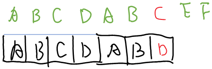
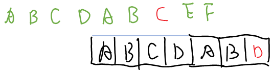
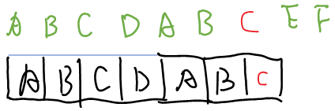

<br>

先来看常见算法的时间复杂度（来自<https://www.bigocheatsheet.com/>)：


`1`. 给定一个整数数组 nums 和一个目标值 target，请你在该数组中找出和为目标值的那 两个 整数，并返回他们的数组下标。

你可以假设每种输入只会对应一个答案。但是，你不能重复利用这个数组中同样的元素。

第一种解法，不依赖外部空间，复杂度O(n^2)
```cpp
class Solution {
public:
    vector<int> twoSum(vector<int>& nums, int target) {
        for(int i=0; i< nums.size(); i++){
            for(int j=i + 1; j< nums.size(); j++){
                if(nums[i] + nums[j] == target){
                    return {i, j};
                }
            }
        }
        return {};
    }
};
```

当可以借助外部空间时，则可以借助红黑树先对数据做索引

如果允许修改nums，则先对num排序然后二分查找。

`2`. 给出两个 非空 的链表用来表示两个非负的整数。其中，它们各自的位数是按照 逆序 的方式存储的，并且它们的每个节点只能存储 一位 数字。

如果，我们将这两个数相加起来，则会返回一个新的链表来表示它们的和。

您可以假设除了数字 0 之外，这两个数都不会以 0 开头。

直接贴代码：

```cpp
/**
 * Definition for singly-linked list.
 * struct ListNode {
 *     int val;
 *     ListNode *next;
 *     ListNode(int x) : val(x), next(NULL) {}
 * };
 */
#include<cassert>
class Solution {
public:
    ListNode* addTwoNumbers(ListNode* l1, ListNode* l2) {
        if(l1 == nullptr || l2 == nullptr){
            return nullptr;
        }
        ListNode *p1 = l1;
        ListNode *p2 = l2;
        ListNode *p_r_head = nullptr;
        ListNode *p_r = nullptr;
        int c = 0;
        while(p1 != nullptr || p2 != nullptr || c){
            if(p_r == nullptr){
                if(p_r_head == nullptr){
                    p_r_head = new ListNode(0);
                    p_r = p_r_head;
                }else{
                    // This should not happen.
                    assert(false);
                }
            }else{
                p_r->next = new ListNode(0);
                p_r = p_r->next;
            }
            int sum_c = 0;
            if(p1){
                sum_c += p1->val;
            }
            if(p2){
                sum_c += p2->val;
            }
            sum_c += c;
            if(sum_c >= 10){
                c  = 1;
            }else{
                c = 0;
            }
            p_r -> val = sum_c % 10;
            if(p1){
                p1 = p1->next;
            }
            if(p2){
                p2 = p2->next;
            }
        }
        return p_r_head;
    }
};
```

注意两点：
1. 位数不相等时相加
2. 位数相等时相加但还有进位


`3`. 给定一个入栈序列和另外一个序列，判断该序列是否是该入栈序列的出栈序列：

假设入栈序列是1，2， 3， 4， 5，出栈序列4，5，3，2，1，使用一个辅助栈，由于第一个出栈是4，因此需要把1，2，3都压栈，把4出栈，依次类推。

引申：给定一个入栈序列，求出栈序列：先求出全排列，然后检查每个全排列是不是出栈序列


`4`. 给出 n 代表生成括号的对数，请你写出一个函数，使其能够生成所有可能的并且有效的括号组合。（leetcode22）
思路：递归+回溯即可，在递归的时候如果左括号小于右括号数量，则直接返回
核心代码如下：
```cpp
void generateParenthesisCore(vector<char> &path, vector<vector<char>> &paths, const int &num_left, const int &num_right, const int &n){
    if(num_right > num_left){
        return;
    } else if(num_right == num_left){
        if(num_left == n){
            paths.push_back(path);
        }else{
            path.push_back('(');
            generateParenthesisCore(path, paths, num_left + 1, num_right, n);
            path.pop_back();
            path.push_back(')');
            generateParenthesisCore(path, paths, num_left, num_right+1, n);
            path.pop_back();
        }
    }else if(num_right < num_left){
        if(num_left ==n){
            path.push_back(')');
            generateParenthesisCore(path, paths, num_left, num_right+1, n);
            path.pop_back();
        }else{
            path.push_back('(');
            generateParenthesisCore(path, paths, num_left + 1, num_right, n);
            path.pop_back();
            path.push_back(')');
            generateParenthesisCore(path, paths, num_left, num_right+1, n);
            path.pop_back();
        }
    }
}
```

### 剑指offer
`1.` 在一个长度为 n 的数组 nums 里的所有数字都在 0～n-1 的范围内。数组中某些数字是重复的，但不知道有几个数字重复了，也不知道每个数字重复了几次。请找出数组中任意一个重复的数字。
leetcode 链接：<https://leetcode-cn.com/problems/shu-zu-zhong-zhong-fu-de-shu-zi-lcof/><br>
几种思路：<br>
(1) 直接排序，时间复杂度O(nlogn)，空间复杂度O(1)，PS：快排的空间复杂度为O(logn), 堆排序的空间复杂度为O(1)，时间复杂度为O(nlogn)，非稳定排序有：
快速排序，希尔排序，选择排序，堆排序
(2) 用一个哈希表来存储元素，遇到一个元素插入哈希表
(3) 用抽屉原理，时间复杂度O(n), 空间复杂度O(1).
```cpp
// 首先问清楚面试官需求，时间复杂度//空间复杂度//能否更改原数组等
#include <utility>
class Solution {
public:
    int findRepeatNumber(vector<int>& nums) {
        for(int i=0; i< nums.size(); ++i){
            while(nums[i] != i){
                if(nums[i] == nums[nums[i]]){
                    return nums[i];
                }else{
                    int tmp = nums[nums[i]];
                    nums[nums[i]] = nums[i];
                    nums[i] = tmp;
                }
            }   
        }
        return 0;
    }
};
```

2. 给你一根长度为 n 的绳子，请把绳子剪成整数长度的 m 段（m、n都是整数，n>1并且m>1），每段绳子的长度记为 k[0],k[1]...k[m] 。请问 k[0]*k[1]*...*k[m] 可能的最大乘积是多少？例如，当绳子的长度是8时，我们把它剪成长度分别为2、3、3的三段，此时得到的最大乘积是18。<br>
PS: 这道题没有限制剪的次数，因此如果用F(n)表示长度为n的绳子可以拿到的最大乘积，则<br>
F(n) 有两种情况(1) 不切分，(2)，切分，若切分，则可以看作切分成i和F(n-i)<br>
F(n) = max(n, 1 * F(n-1), 2 * F(n-2), 3 * F(n-3), 4 * F(n-4))<br>
注意题目要求至少切割一次，因此，当n<3时，由于最大的乘积是它本身，但不能返回本身<br>
代码如下：<br>

3. 快速冥求余
```python
# 求 (x^a) % p —— 快速幂求余
def remainder(x, a, p):
    rem = 1
    while a > 0:
        if a % 2: rem = (rem * x) % p
        x = x ** 2 % p
        a //= 2
    return rem
```
```cpp
class Solution {
public:
    int cuttingRope(int n) {
        vector<int> dp(n+1);
        dp[0] = 0;
        dp[1] = 1;
        for(int i = 2; i<= n; i++){
            int max_cum =0;
            for(int j=1; j< i; ++j){
                max_cum = std::max(max_cum, dp[i-j] * j);
            }
            if(i==n){
                return max_cum;
            }
            max_cum = std::max(max_cum, i);
            dp[i] = max_cum;
        }
        return dp[n];
    }
};
```


### 字节跳动面经
`1`. 给一个成绩，查排名
建个索引吧qwq

`2`. 找出链表之间是否有相交的点
假设链表没有环，则最后一个节点一定是

`3`. 股票最大利润

dp算法

`4`. 单链表前后交叉排序
先排序，然后算长度，然后改成拆成两个链表，然后两个有序链表合并即可

`5`. 因式分解
用回溯法+递归即可，注意两点：首先假设taget=a*b，不妨假设a `<` b ，则一定有`a ** a <= target`，另外保证整体有序，即可保证因式分解没有重复：

代码如下：
```cpp
#include <iostream>
#include <vector>
#include <iostream>
using namespace std;

class Solution{
public:
    vector<vector<int>> getFactors(int target){
        vector<vector<int>> r;
        vector<int> factors;
        get_factors_core(factors, r, 2, target);
        return r;
    };
    void get_factors_core(vector<int> &factors, vector<vector<int>> &r, int start, int target){
        for(int i=start; i*i <= target; i ++){
            if(target%i ==0){
                factors.push_back(i);
                factors.push_back(target / i);
                r.push_back(factors);
                factors.pop_back();
                get_factors_core(factors, r, i, target / i);
                factors.pop_back();
            }
        }
    }

};
```

`6`. 从字符串S变到T，插入消耗2、删除消耗2、替换消耗3、求最小消耗
用DP来解决即可，j见<https://leetcode-cn.com/problems/edit-distance/comments/>，下面的代码考虑所有消耗都是1
```cpp
class Solution {
public:
    int minDistance(string word1, string word2) {
        if(word1.size()==0){
            return word2.size();
        }
        if(word2.size() ==0){
            return word1.size();
        }
        auto pHistoryStates = std::make_shared<vector<int>>();
        pHistoryStates->resize(word2.size()+1);
        for(int i=0; i<=word2.size(); ++i){
            pHistoryStates->at(i) = i;
        }
        for(int i=1; i<= word1.size(); ++i){
            auto pCurStates = std::make_shared<vector<int>>();
            pCurStates->resize(word2.size()+1);
            pCurStates->at(0) = i;
            for(int j=1; j<=word2.size(); ++j){
                int distance0 = pHistoryStates->at(j-1);
                if(word1[i-1]!=word2[j-1]){
                    distance0 += 1;
                }
                int distance1 = pHistoryStates->at(j) + 1;
                int distance2 = pCurStates->at(j-1) + 1;
                pCurStates->at(j) = std::min(std::min(distance1, distance2), distance0);
            }
            pHistoryStates = pCurStates;
        }
        return pHistoryStates->at(word2.size());
    }
};
```

`7`. 在字符串中找出不重复字符的个数

`8`. 找出两个只出现一次的数字，其余的数字都出现了两次

`9`. 给个数组求连续子序列最大和

`10`. 判断是否为平衡二叉树

`11`. 找出一个字符串的最长不重复子串(滑动窗口?)

`12`. 链表排序： 

(1) 用一个每次走两步的指针和走一步的指针同时遍历，当走两步的指针到尾部的时候，慢指针指向链表的中间。

(2) 对子链表进行排序

(3) 合并两个有序链表

### KMP算法
假定模式串pattern，待匹配字符串target, 定义dp数组[i][c]为：
已知模式串的前i个字符和待匹配字符串的的前i个字符串完全相同的情况下，新来一个字符c，使得模式串的前k个字符和包含c的后k个字符相同的最大的k, 不妨把它命名为最大公共前后缀长度。

例如模式串为`ABCDABC`，待匹配字符串为`ABCDABCD`，某一时刻匹配情况如下：


此时待匹配字符串的前6个字符与模式串的前6个字符完全相同，新来了一个字符`C`，待匹配字符串的后3个字符为`ABC`，与模式串的前3个字符`ABC`一致，因此dp[5][`C`]=3，也即，模式串向右移动后，模式串的前3个字符会与目标字符串完全匹配，如下图所示：



dp数组的求法如下:<br>
(1): 若pattern[i]==target[i]==`C`<br>


此时模式串的前(i+1)个字符与目标字符串的后(i+1)个字符串相同，都是ABCDABC，因此：dp[i][`C`]=i+1

(2): 若pattern[i]$\neq$target[i] = `C`<br>
不妨把dp[i][pattern[i]]定义为$X_i$，则有$X_i=dp[X_{i-1}][pattern[i]]$，且有dp[i][`C`]=dp[X][`C`], PS: 这一段用文字解释起来比较绕，需要仔细想一想原因，

上述求解过程转为代码如下：
```cpp
vector<vector<int>> solveDP(const string&pattern){
    vector<vector<int>> &dp;
    dp.resize(pattern.size());
    for(auto &x:dp){
        x.resize(256);
    }
    for(int i=0, X=0; i< pattern.size(); i++){
        for(int j=0; j< 256; j++){
            //假定新来的字符是j
            if(j==pattern[i]){
                dp[i][j] = i+1; // 包括字符j，共有i+1个字符匹配,最大公共前后缀长度为i+1
            }else{
                dp[i][j] = dp[X][j]; 
            }
        }
        // 求解模式字符串中前i个字符的最大公共前后缀长度k
        if(i>0){
            X = dp[X][pattern[i-1]];
        }else{
            X = 0; // 模式串前0个字符的最大公共前后缀为0
        }
    }
    return dp;
}
```

有了dp数组之后，就可进行利用dp来匹配字符串了：
```cpp
int match(const string& pattern, const string target){
    if(target.size() < 1 || pattern.size() < ){
        return 0;
    }
    int p_pattern = 0;
    int p_target = 0;
    while(p_target < target.size()){
        p_pattern = dp[p_pattern][p_target];
        if(p_pattern==pattern.size()){
            return p_target;
        }
        p_target ++;
    }
}
```

完整程序如下：
```cpp
#include <string>
#include <iostream>
#include <string>
#include <vector>
#include <memory>
using namespace std;

class Solution {
    vector<vector<int>>dp;
public:
    void init_dp(const string &pattern){ 
        if(pattern.size() == 0){
            dp.resize(0);
            return;
        }
        dp.resize(pattern.size());
        for(auto &x:dp){
            x.resize(256);
        }
        for(int i=0,X=0; i< dp.size(); ++i){
            for(int j=0; j<256; ++j){
                if(pattern[i]== j){
                    dp[i][j] = i+1;
                }else{
                    dp[i][j] = dp[X][j];
                }
            }
            if(i==0){
                X = 0;
            }else{
                // 只与模式串有关
                // 已知了前i-1个字符的最大公共前后缀的长度，求第i个字符的最大前后缀的长度
                X = dp[X][pattern[i]];
            }
        }
        return;
    }
    int strStr(string haystack, string needle) {
        if(haystack.size() ==0 && needle.size() ==0){
            return 0;
        }
        if(haystack.size() ==0 && needle.size() !=0){
            return -1;
        }
        if(haystack.size() !=0 && needle.size() ==0){
            return 0;
        }
        this->init_dp(needle);
        int p_pattern = 0;
        int p_target = 0;
        while(p_target < haystack.size()) {
            p_pattern = this->dp[p_pattern][haystack[p_target]];
            if(p_pattern == needle.size()){
                return p_target+1-needle.size();
            }
            p_target ++;
        }
        if(p_pattern != needle.size()){
            return -1;
        }else{
            return p_target+1-needle.size();
        }
    }
};

void test_strStr(){
    auto so = std::make_shared<Solution>();
    string haystack = "hello";
    string needle = "ll";
    auto r0 = so->strStr("hello", "ll");
    cout << r0 << endl; // r0 should be 2
    auto r1 = so->strStr("aaaaa", "bba");
    cout << r1 << endl; // r0 should be -1
}

int main(){
    test_strStr();
}
```


<!-- 首先定义k，k定义为最大的k,使得某一个字符串的前k个字符和后k个字符完全相等。
例如，字符串ABCDABC的k为3。

再考虑已知$k_0, k_1, k_2\cdots k_{n-1}$，其中$k_i$表示字符串前$i$个字符所组成的字串的$k$的情况下，如何求$k_n$。

例如字符串str=$x_0x_1x_2x_0x_1$，$k_0=0,k_1=1,k_2=0,k_3=0,k_4=1,k_5=2k_1=1,k_2=0,k_3=0,k_4=1,k_5=2$，令$\mathbf{X}=k_{n1-1}=2$, 当新来了一个字符$c_{new}$，有两种情况：<br>
(1). str[X+1]=$c_{new}$，显然此时$k_{n}=k_{n-1}+1$<br>
(2). str[X+1] $\neq c_{new}$，此时$k_{n}=k_{k_{n-1}}$，例如当新的字符为$x_0$时，$k_n=k_2=1$，或者可以写作$X=k_{X}$

定义dp数组，dp[i][$x$]表示在第i个字符串已知的情况下，最后的字符为$x$时的k，例如已知字符串str=$x_0x_1x_2x_0x_1$，则dp[5][$x_0$]=1,dp[5][$x_2$]=3

根据以上分析，可以写出代码：
```cpp
string str="ABCDABC";
vector<vector<int>> dp;
dp.resize(str.size() + 1);
for(auto &x:dp){
    x.resize(256, 0);
}
for(int i=1; i<dp.size(); ++i>){
    for(int c=0; c< 256; c++>){
        if(c==str[i-1]{
            dp[i][c]= i + 1;
        }
    }
}
``` -->
